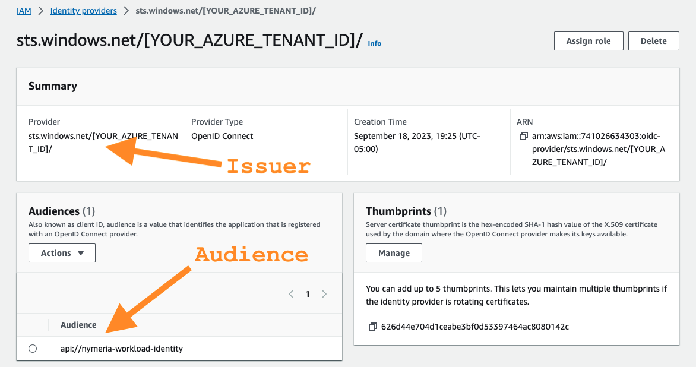

# AWS Identity Federation

During the [Getting Started](./getting_started.md) section, you deployed the *02_aws_init* Terraform configuration to your AWS account. The AWS configuration includes an AWS Identity Provider resource that trusts your Azure Entra ID tenant and an IAM role with permissions to read data from the Nymeria S3 bucket. In this section, we will explore how the AWS Identity Provider configuration trusts the Nymeria virtual machine and confirm the virtual machine can assume the IAM role.

## Nymeria Virtual Machine Identity Token

Connect to the Nymeria virtual machine and request an OpenID Connect identity token from Instance Metadata Service (IMDS) with the audience set to `api://nymeria-workshop`. Then, decode the JWT to view the subject, issuer, and audience claims.

1. Browse to the [Azure Portal](https://portal.azure.com/){: target="_blank" rel="noopener"} open **Cloud Shell** again.

    

1. Run the following command to connect to the Nymeria virtual machine over SSH.

    ```bash
    cd ~/clouddrive/nymeria/src/workshop/04_gh_action/
    NYMERIA_FQDN=$(terraform output --json | jq -r '.azure_virtual_machine_fqdn.value')
    ssh -i ~/.ssh/nymeria.pem ubuntu@$NYMERIA_FQDN
    ```

    !!! abstract "Terminal Output"
        If you have successfully connected to the Nymeria virtual machine. The prompt should look like the following:

        ```bash
        Welcome to Ubuntu 22.04.3 LTS (GNU/Linux 6.2.0-1012-azure x86_64)
        ...
        ubuntu@nymeria:~$
        ```

1. Run the following command in the Nymeria virtual machine to request an OpenID Connect JSON Web Token (JWT) with the audience set to `api://nymeria-workshop`. The return value will be stored in the `AZURE_JWT` environment variable.

    ```bash
    AZURE_JWT=$(curl -s "http://169.254.169.254/metadata/identity/oauth2/token?api-version=2018-02-01&resource=api://nymeria-workshop" -H "Metadata: true" | jq -r '.access_token')
    ```

1. Run the following command to decode the JWT.

    ```bash
    jq -R 'split(".") | .[1] | @base64d | fromjson' <<< "$AZURE_JWT"
    ```

    !!! abstract "Terminal Output"
        ```json
        {
          "aud": "api://nymeria-workshop",
          "iss": "https://sts.windows.net/[YOUR_AZURE_TENANT_ID]/",
          "iat": 1695248707,
          "nbf": 1695248707,
          "exp": 1695335407,
          "aio": "E2FgYBGc6rGGA2rdd8+4T5srd345DDD=",
          "appid": "e925f5a3-240b-464c-b44b-f2ba753231be",
          "appidacr": "2",
          "idp": "https://sts.windows.net/[YOUR_AZURE_TENANT_ID]/",
          "oid": "1a3b54b3-2812-4c44-bb40-9e4fe51760a3",
          "rh": "0.AVgAaMf7MCTi0EaQ92P3QneTKEpwXyZXB19Jo9CxYRO9mM9YAAA.",
          "sub": "[YOUR_NYMERIA_VM_SUBJECT_ID]",
          "tid": "[YOUR_AZURE_TENANT_ID]",
          "uti": "gN-9UtHAXUCaxbGiix6uAQ",
          "ver": "1.0"
        }
        ```

1. The Nymeria virtual machine's claims in the decoded JWT are as follows:

    - The identity token's `iss` claim is set to `https://sts.windows.net/[YOUR_AZURE_TENANT_ID]/`.

    - The identity token's `aud` claim is set to `api://nymeria-workshop`.

    - The identity token's `sub` uniquely identifies the Nymeria virtual machine. The unique identifier is the Azure virtual machine's managed identity object id in the Entra ID tenant.

## AWS Identity Provider

Inspect the AWS Identity Provider and IAM Role configuration. Confirm the OpenID Connect token's subject, issuer, and audience claims match the values found in the Nymeria Virtual Machine Identity Token.

1. Sign into the [AWS Web Console](https://console.aws.amazon.com/){: target="_blank" rel="noopener"} again.

1. Set the region (top right-hand corner) to `us-east-2 (Ohio)`.

1. Navigate to the [IAM](https://console.aws.amazon.com/iam/home?region=us-east-2#/home){: target="_blank" rel="noopener"} service.

1. Select the *Identity providers* menu item from the left-hand menu.

    

1. Select the *sts.windows.net/[YOUR_AZURE_TENANT_ID]* identity provider to view the details.

1. Confirm the following configuration matches the Nymeria virtual machine's identity token. The configuration grants any identity token issued by the Azure Entra ID tenant access to the AWS account's identity provider resource.

    - The **Provider** matches the Nymeria virtual machine's identity token's `iss` claim: `https://sts.windows.net/[YOUR_AZURE_TENANT_ID]/`.

    - The **Audience** matches the Nymeria virtual machine's identity token's `aud` claim: `api://nymeria-workshop`.

    

1. The AWS identity provider resource does not inherently grant access to IAM permissions. Permissions are granted using an IAM Role's trust policy. To view the Nymeria IAM Role's trust policy, select the *Roles* menu item from the left-hand menu. Search for the `nymeria-azure-vm-role` role and open the details.

    

- On the `nymeria-azure-vm-role` role's details page, select the *Trust relationships* tab.

    

- Inspect the `nymeria-azure-vm-role` role's trust policy granting the assume role permission to the Nymeria virtual machine's managed identity.

    !!! abstract "IAM Role Trust Policy "
        ```json
        {
          "Version": "2012-10-17",
          "Statement": [
            {
              "Sid": "",
              "Effect": "Allow",
              "Principal": {
                "Federated": "arn:aws:iam::123456789012:oidc-provider/sts.windows.net/[YOUR_AZURE_TENANT_ID]}/"
              },
              "Action": "sts:AssumeRoleWithWebIdentity",
              "Condition": {
                "StringEquals": {
                    "sts.windows.net/[YOUR_AZURE_TENANT_ID]/:aud": "api://nymeria-workload-identity",
                    "sts.windows.net/[YOUR_AZURE_TENANT_ID]/:sub": "[YOUR_NYMERIA_VM_SUBJECT_ID]"
                }
              }
            }
          ]
        }
        ```

        - The *Principal* element trusts tokens issued by the Entra ID tenant.
        
        - The `aud` condition validates the token's audience claim is equal to `api://nymeria-workload-identity`.
        
        - The `sub` condition validates the token's subject claim is equal to the Nymeria virtual machine's managed identity object id.

!!! danger "Privilege Escalation Path"
    Misconfigured identity federation IAM trust policies can allow privilege escalation vulnerabilities. Researchers have identified several instances with [misconfigured GitHub action trust policies](https://www.wiz.io/blog/a-security-community-success-story-of-mitigating-a-misconfiguration){: target="_blank" rel="noopener"}. The root cause is forgetting to apply the `sub` condition restricting access to a specific principal.

## AWS Workload Identity Federation

Use the Nymeria virtual machine's OpenID Connect token to assume the AWS IAM role. Then, use the temporary credentials to access data in AWS S3.

1. Browse to the [Azure Portal](https://portal.azure.com/){: target="_blank" rel="noopener"} open **Cloud Shell** again.

    

1. Run the following command to connect to the Nymeria virtual machine over SSH.

    ```bash
    cd ~/clouddrive/nymeria/src/workshop/04_gh_action/
    NYMERIA_FQDN=$(terraform output --json | jq -r '.azure_virtual_machine_fqdn.value')
    ssh -i ~/.ssh/nymeria.pem ubuntu@$NYMERIA_FQDN
    ```

    !!! abstract "Terminal Output"
        If you have successfully connected to the Nymeria virtual machine. The prompt should look like the following:

        ```bash
        Welcome to Ubuntu 22.04.3 LTS (GNU/Linux 6.2.0-1012-azure x86_64)
        ...
        ubuntu@nymeria:~$
        ```

1. Run the following command in the Nymeria virtual machine to request an OpenID Connect JSON Web Token (JWT) with the audience set to `api://nymeria-workshop`. The return value will be stored in the `AZURE_JWT` environment variable.

    ```bash
    AZURE_JWT=$(curl -s "http://169.254.169.254/metadata/identity/oauth2/token?api-version=2018-02-01&resource=api://nymeria-workshop" -H "Metadata: true" | jq -r '.access_token')
    ```

1. Source the environment variables in the `~/.aws/get-resources.sh` script and verify the role ARN is populated in the `AWS_CROSS_CLOUD_ROLE_ARN` environment variable.

    ```bash
    source ~/.aws/get-resources.sh 
    echo $AWS_CROSS_CLOUD_ROLE_ARN
    ```

    !!! abstract "Terminal Output"
        ```bash
        arn:aws:iam::123456789012:role/nymeria-azure-vm-role
        ```

1. Run the following command to assume the `nymeria-azure-vm-role` AWS IAM role using the Nymeria virtual machine's OpenID Connect token.

    ```bash
    export $(aws sts assume-role-with-web-identity --role-arn "$AWS_CROSS_CLOUD_ROLE_ARN" --role-session-name "nymeria-demo" --web-identity-token "$AZURE_JWT" --duration-seconds 3600 --output text --query "[['AWS_ACCESS_KEY_ID',Credentials.AccessKeyId],['AWS_SECRET_ACCESS_KEY',Credentials.SecretAccessKey],['AWS_SESSION_TOKEN',Credentials.SessionToken]][*].join(\`=\`,@)")
    ```

1. Verify the AWS IAM role was successfully assumed by running the following command.

    ```bash
    aws sts get-caller-identity
    ```

    !!! abstract "Terminal Output"
        ```bash
        {
          "UserId": "AROAEXAMPLE:nymeria-demo",
          "Account": "123456789012",
          "Arn": "arn:aws:sts::123456789012:assumed-role/nymeria-azure-vm-role/nymeria-demo"
        }
        ```

1. Run the `aws s3 cp` command to download the Nymeria image from the S3 bucket using the stolen long-lived credentials.

    ```bash
    aws s3 cp s3://$AWS_S3_BUCKET_ID/aws-workload-identity.png ~/aws-workload-identity.png
    ls -la ~/aws-workload-identity.png
    ```

    !!! abstract "Terminal Output"
        ```bash
        download: s3://nymeria-cross-cloud-iulqhgnx/aws-workload-identity.png to ./aws-workload-identity.png
        -rw-rw-r-- 1 ubuntu ubuntu 156686 Sep 19 00:25 /home/ubuntu/aws-workload-identity.png
        ```

## Next Steps

!!! success "AWS Workload Identity"
    With this configuration, we have successfully killed the AWS long-lived access keys. The Nymeria virtual machine is now using its native identity token (JWT) to assume the AWS IAM Role and access the AWS S3 API.

Next, move on to the [Google Workload Identity Federation](./gcp.md) section to learn how to authenticate the Nymeria virtual machine using AWS Identity Federation.
