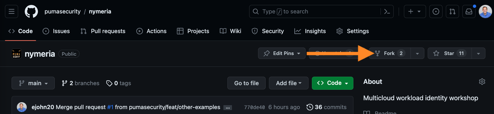
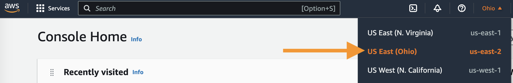
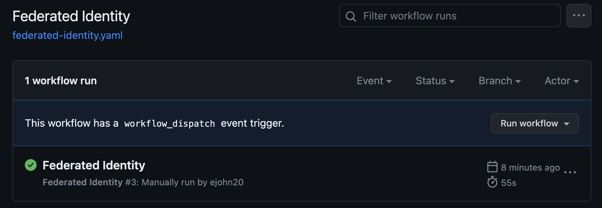

# Getting Started

## Prerequisites

Make sure you have completed the [Prerequisites](./prerequisites.md) before starting the workshop.

- [x] GitHub Account
- [x] Azure Subscription
- [x] AWS Account
- [x] Google Cloud Project

## GitHub Repository Configuration

Start by forking Puma Security's [Nymeria Workload Identity Repository](https://github.com/pumasecurity/nymeria){: target="_blank" rel="noopener"} into your personal GitHub account.

1. Sign in to your GitHub account.

1. Browse to the Puma Security [Nymeria Workload Identity Repository](https://github.com/pumasecurity/nymeria){: target="_blank" rel="noopener"}.

1. In the top right-hand corner, press the **Fork** button to fork the repository to your personal GitHub account.

    

1. Press the **Create fork** button to fork the repository into your personal GitHub account.

1. In your forked repository, press the **Code** button and select **HTTPS** to view your clone URL. Press the copy button to put the clone URL onto your clipboard. Keep this value handy as you will need it later to bootstrap each cloud environment.

    

## Azure Subscription

### Azure Bootstrap

Complete the following steps to create the resources required to authenticate the Nymeria GitHub Action to your Azure subscription.

1. Sign into the [Azure Portal](https://portal.azure.com/){: target="_blank" rel="noopener"} and press the **Cloud Shell** icon next to the search box.

    

1. Run the following commands in the Terminal to clone your `nymeria` repository into the Azure cloud drive.

    ```bash
    cd ~/clouddrive
    git clone [ENTER_YOUR_CLONE_URL]
    ```

1. Change the directory to the `~/clouddrive/nymeria/src/01_azure_init` directory.

    ```bash
    cd ~/clouddrive/nymeria/src/workshop/01_azure_init/
    ```

1. Apply the Terraform configuration to bootstrap your Azure subscription with both long-lived credentials and the workload identity resources.

    ```bash
    export TF_VAR_github_repository=nymeria
    export TF_VAR_github_organization=[ENTER_YOUR_GITHUB_USERNAME]
    terraform init
    terraform plan
    terraform apply -auto-approve
    ```

1. Terraform should confirm the successful creation of the workload identity resources.

    !!! abstract "Terminal Output"
        ```bash
        Apply complete! Resources: 13 added, 0 changed, 0 destroyed.

        Outputs:

        azure_subscription_id = <sensitive>
        azure_tenant_id = <sensitive>
        azure_virtual_machine_user_identity_id = "__redacted__"
        github_service_principal_client_id = <sensitive>
        github_service_principal_client_secret = <sensitive>
        resource_group_name = "nymeria-federated-identity"
        terraform_state_storage_account_name = "terraformmlgxt9hl"
        ```

### Azure GitHub Secret

Configure the required GitHub Action secret for the Nymeria repository to deploy resources to your Azure subscription.

1. Run the following command to display the Terraform output values.

1. Note the values of the `azure_tenant_id` and `azure_virtual_machine_user_identity_principal_id` outputs. These will be needed to bootstrap both your AWS and Google Cloud accounts.

1. Copy the entire output value onto the clipboard for use in the next step.

    ```bash
    terraform output --json
    ```

    !!! abstract "Terminal Output"
        ```json
        {
          "azure_subscription_id": {
            "sensitive": true,
            "type": "string",
            "value": "__redacted__"
          },
          "azure_tenant_id": {
            "sensitive": true,
            "type": "string",
            "value": "__redacted__"
          },
          "azure_virtual_machine_user_identity_id": {
            "sensitive": false,
            "type": "string",
            "value": "__redacted__"
          },
          "github_service_principal_client_id": {
            "sensitive": true,
            "type": "string",
            "value": "__redacted__"
          },
          "github_service_principal_client_secret": {
            "sensitive": true,
            "type": "string",
            "value": "__redacted__"
          },
          "resource_group_name": {
            "sensitive": false,
            "type": "string",
            "value": "nymeria-federated-identity"
          },
          "terraform_state_storage_account_name": {
            "sensitive": false,
            "type": "string",
            "value": "terraformznoypqbp"
          }
        }
        ```

1. Browse to your GitHub repository's **Settings**.

    

1. In the left navigation, press the **Secrets and variables > Actions** menu item.

    

1. Press the **New repository secret** button.

1. Enter the following values for the new secret:

    - **Name**: `AZURE_BOOTSTRAP`

    - **Secret**: [Paste the JSON Terraform output]

1. Press the **Add Secret** button.

## AWS Account

### AWS Bootstrap

Complete the following steps to create the resources required for the Azure virtual machine to authenticate your AWS account.

1. Sign into the [AWS Web Console](https://console.aws.amazon.com/){: target="_blank" rel="noopener"}.

1. Set the region (top right-hand corner) to `us-east-2 (Ohio)`.

    

    !!! question "Why Ohio?"
        The Terraform deployment uses the `us-east-2` region by default. This can be overridden by setting the `TF_VAR_region` environment variable to a different region.

1. Press the **Cloud Shell** icon next to the search box.

    

1. Unlike Azure and Google Cloud, the AWS CloudShell does not come with Terraform preinstalled. You will need to install Terraform before you can initialize your AWS account.

    ```bash
    git clone https://github.com/tfutils/tfenv.git ~/.tfenv
    mkdir ~/bin
    ln -s ~/.tfenv/bin/* ~/bin/
    tfenv install 1.5.7
    tfenv use 1.5.7
    terraform --version
    ```

1. Run the following commands to clone your `nymeria` repository into the AWS cloud drive.

    ```bash
    git clone [ENTER_YOUR_CLONE_URL]
    ```

1. Change the directory to the `~/nymeria/src/workshop/02_aws_init/` directory.

    ```bash
    cd ~/nymeria/src/workshop/02_aws_init/
    ```

1. Apply the Terraform configuration to bootstrap your AWS account with both long-lived credentials and the workload identity resources.

    ```bash
    export TF_VAR_azure_tenant_id=[ENTER_YOUR_AZURE_TENANT_ID]
    export TF_VAR_azure_virtual_machine_managed_identity_principal_id=[AZURE_VIRTUAL_MACHINE_USER_IDENTITY_PRINCIPAL_ID]
    terraform init
    terraform plan
    terraform apply -auto-approve
    ```

1. Terraform should confirm the successful creation of the workload identity resources.

    !!! abstract "Terminal Output"
        ```bash
        Apply complete! Resources: 10 added, 0 changed, 0 destroyed.

        Outputs:

        aws_default_region = "us-east-2"
        aws_s3_bucket = "nymeria-cross-cloud-ipdrhsne"
        azure_vm_aws_access_key_id = <sensitive>
        azure_vm_aws_role_arn = "arn:aws:iam::111111111111:role/nymeria-azure-vm-role"
        azure_vm_aws_secret_access_key = <sensitive>
        ```

### AWS GitHub Secret

1. From the AWS CloudShell terminal, run the following command to display the Terraform output.

    ```bash
    terraform output --json
    ```

1. Copy the entire output value onto the clipboard for use in the next step.

    !!! abstract "Terminal Output"
        ```json
        {
          "aws_s3_bucket": {
            "sensitive": false,
            "type": "string",
            "value": "nymeria-cross-cloud-yh831o00"
          },
          "azure_vm_aws_access_key_id": {
            "sensitive": true,
            "type": "string",
            "value": "__redacted__"
          },
          "azure_vm_aws_role_arn": {
            "sensitive": false,
            "type": "string",
            "value": "arn:aws:iam::111111111111:role/nymeria-azure-vm-role"
          },
          "azure_vm_aws_secret_access_key": {
            "sensitive": true,
            "type": "string",
            "value": "__redacted__"
          }
        }
        ```

1. Browse to your GitHub repository's **Settings**.

    

1. In the left navigation, press the **Secrets and variables > Actions** menu item.

    

1. Press the **New repository secret** button.

1. Enter the following values for the new secret:

    - **Name**: `AWS_BOOTSTRAP`

    - **Secret**: Paste the JSON Terraform output

1. Press the **Add Secret** button.

## Google Cloud Project

### Google Cloud Bootstrap

Complete the following steps to create the resources required for the Azure virtual machine to authenticate your Google cloud project.

1. Sign into the [Google Cloud Web Console](https://console.cloud.google.com/){: target="_blank" rel="noopener"}.

1. Select your project in the dropdown list (see #1 in the screenshot below).

1. Note the value of the **Project ID** as you will need it later to bootstrap your Google Cloud project (see #2 in the screenshot below).

1. Press the **Cloud Shell** icon next to the search box (see #3 in the screenshot below).

    

1. Run the following commands to clone your `nymeria` repository into the Google cloud drive.

    ```bash
    git clone [ENTER_YOUR_CLONE_URL]
    ```

1. Change the directory to the `~/clouddrive/nymeria/src/03_gcp_init` directory.

    ```bash
    cd ~/nymeria/src/workshop/03_gcp_init/
    ```

1. Apply the Terraform configuration to bootstrap your Google Cloud project with both long-lived credentials and the workload identity resources.

    !!! info "Note"
        The Cloud Shell session will prompt you to grant Terraform permission to authenticate to the project. You will need to press the **Authorize** button to continue.

    ```bash
    export TF_VAR_project_id=[ENTER_YOUR_GOOGLE_PROJECT_ID]
    export TF_VAR_azure_tenant_id=[AZURE_TENANT_ID]
    export TF_VAR_azure_virtual_machine_managed_identity_principal_id=[AZURE_VIRTUAL_MACHINE_USER_IDENTITY_PRINCIPAL_ID]

    terraform init
    terraform plan
    terraform apply -auto-approve
    ```

1. Terraform should confirm the successful creation of the workload identity resources.

    !!! abstract "Terminal Output"
        ```bash
        Apply complete! Resources: 14 added, 0 changed, 0 destroyed.

        Outputs:

        azure_vm_google_service_account_key = <sensitive>
        gcp_project_id = "nymeria-workshop"
        gcs_bucket = "nymeria-cross-cloud-e9zwi7h7"
        workload_identity_client_configuration = ...
        ```

### Google Cloud GitHub Secret

1. From the Google CloudShell terminal, run the following command to display the Terraform output. Copy the entire output value onto the clipboard for use in the next step.

    ```bash
    terraform output --json
    ```

    !!! abstract "Terminal Output"
        ```json
        {
          "azure_vm_google_service_account_key": {
            "sensitive": true,
            "type": "string",
            "value": "__redacted__"
          },
          "gcs_bucket": {
            "sensitive": false,
            "type": "string",
            "value": "nymeria-cross-cloud-n26pm4d6"
          },
          "workload_identity_client_configuration": {
            "sensitive": false,
            "type": "string",
            "value": "..."
          }
        }
        ```

1. Browse to your GitHub repository's **Settings**.

    

1. In the left navigation, press the **Secrets and variables > Actions** menu item.

    

1. Press the **New repository secret** button.

1. Enter the following values for the new secret:

    - **Name**: `GCP_BOOTSTRAP`

    - **Secret**: Paste the JSON Terraform output

1. Press the **Add Secret** button.

## Nymeria GitHub Deployment

The final setup step is deploying the Nymeria virtual machine to your Azure subscription. This virtual machine will be used to authenticate to your AWS and Google Cloud accounts.

1. In your GitHub repository, navigate to the *Actions* tab. Then, click on the *I understand my workflows, go ahead and enable them.* button.

    

1. Click on the *Federated Identity* workflow. On the right, press the *Run workflow* dropdown list and then press the *Run workflow* button. This will start the workflow on the `main` branch.

    

1. The *Federated Identity* workflow should complete the a green success status. Feel free to select the run to view the jobs and output logs.

    

## Next Steps

With your Azure, AWS, and Google Cloud accounts bootstrapped, you are ready to start reviewing the [Long-lived Credentials](./long_lived_credentials.md).
