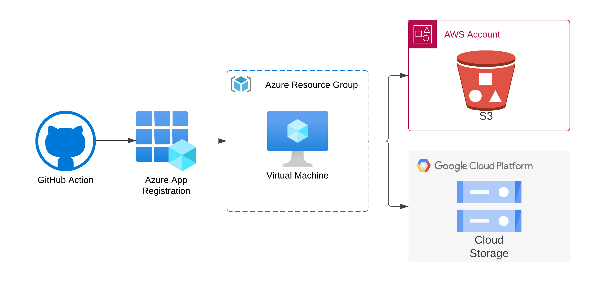

# Workload Identity Federation

Authenticating to public cloud APIs has historically been done using long-lived credentials:

* AWS IAM User Access Keys
* Azure Service Principal Client Id / Secrets
* Google Cloud Service Account JSON Web Tokens (JWT)

Unfortunately, managing long-lived credentials is a massive headache for development, operations, and security teams to manage. Credentials are often stored in plaintext, and are frequently leaked in source code repositories, chat logs, and other insecure locations. Workload Identity Federation is a cloud-native capability that enables authentication to public cloud APIs using an OpenID Connect Identity Provider's JSON Web Token (JWT).

## Hands On Workshop

Nymeria's goal is to help cloud identity and security teams to eliminate long-lived credentials from their cloud estate. The hands on workshop walks you through the following scenario:

1. A GitHub Action needs to authenticate to an Entra ID Tenant to run a Terraform deployment.

1. The Terraform deployment creates an Azure virtual machine that requires data stored in both AWS S3 and Google Cloud Storage (GCS).

There are two ways to complete this architecture. The first pattern relies on long-lived credentials, and the second pattern relies on Workload Identity Federation.

### Long Lived Credentials

1. The GitHub Action uses an Azure Service Principal Client Id and Client Secret for authenticating to the Entra ID Tenant.

1. The Azure Virtual machine uses AWS IAM User Access Keys for authenticating to the AWS S3 API.

1. The Azure Virtual machine uses a Google Cloud Service Account Key for authenticating to the GCS API.

### Workload Identity Federation

1. The GitHub Action uses a built-in OpenID Connect (OIDC) JWT token for authenticating to the Entra ID Tenant.

1. The Azure virtual machine obtains a signed OpenID Connect JWT from the instance metadata service (IMDS). Then, uses the identity token to authenticate to an AWS Identity Provider and access the S3 API.

1. The Azure virtual machine obtains a signed OpenID Connect JWT from the instance metadata service (IMDS). Then, uses the identity token to impersonate a Google Cloud service account and access the GCS API.

## Other Examples

The [Nymeria Other Examples](https://github.com/pumasecurity/nymeria/tree/main/src/other_examples) directory contains additional examples of using Workload Identity Federation to authenticate to public cloud APIs using an OpenID Connect Identity Provider's JSON Web Token (JWT).
